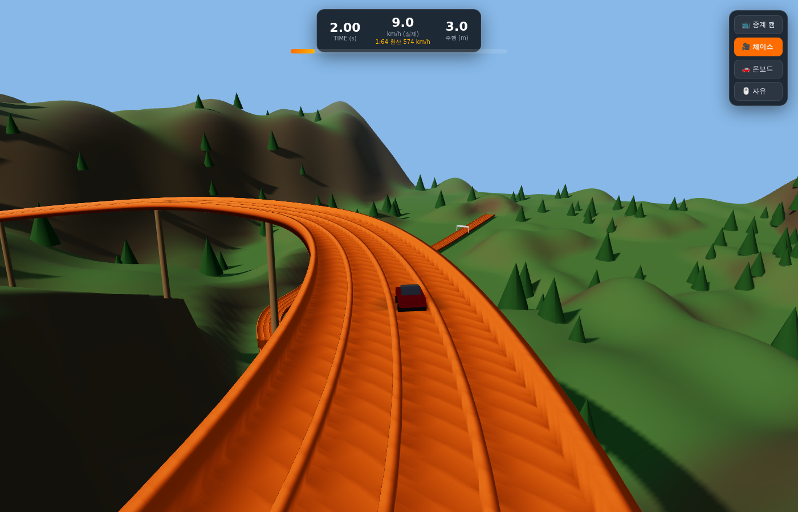

# 🏁 Hot Wheels Downhill — Diecast Gravity Racing

1:64 다이캐스트 미니카 중력 다운힐 레이싱 게임 (Three.js).
실제 다이캐스트 토너먼트 레이싱(3DBotMaker 스타일)을 **실물 스케일 SI 단위 물리**로 재현했다.
조사 내용과 물리 모델·아키텍처는 [PLAN.md](./PLAN.md) 참고.



## 실행

의존성 없음 (three.js는 `vendor/`에 포함, 오프라인 동작). 정적 서버만 있으면 된다.

```bash
python3 -m http.server 8000    # 또는: npx serve
# 브라우저에서 http://localhost:8000 접속
```

## 게임 특징

- **실물 스케일 물리 (240Hz 고정 스텝, 결정론적)** — 차 68mm/30~120g, 트랙 27m, 낙차 2.5m, g=9.81.
  중력 사면 가속, 구름저항, 베어링 상수 마찰, 공기저항, 코너 벽 스크럽, 크레스트 탄도 비행(점프),
  착지 충격 손실까지 전부 시뮬레이션. HUD에 실제 속도와 1:64 환산 속도를 함께 표시.
- **날씨 = 물리** — ☀️맑음 / 🌧️비 / ❄️눈. 같은 차가 맑음 7.97s → 비 8.58s → 눈 9.90s.
  눈길에서는 가벼운 순정차가 점프에 실패하거나 실속(DNF)할 수 있다.
- **커스터마이징** — 출발 레인(레인별 실측 길이·곡률 차이), 총중량(30~120g), 휠/액슬
  (순정/FTE/폴리싱+윤활), 무게 배분, 차체 형상, 색상. 실제 대회 튜닝 원리 그대로 기록에 반영.
- **리플레이 & 하이라이트** — 전 주행 물리 프레임 기록. 타임라인 스크럽,
  0.1×~2× 슬로우모션, 하이라이트(출발/최고속도/점프/코너 공방/피니시) 자동 추출·점프.
- **카메라 4종** — 중계(트랙사이드 자동 컷) / 체이스 / 온보드 / 자유 궤도 (단축키 1~4).
- **1대 타임어택 (다차량 확장 준비)** — 시뮬레이션·기록 구조가 차량 배열 기반이라
  2~4대 동시 출발 토너먼트로 확장 가능.

## 참고 기록 (검증 시뮬레이션)

| 조건 (2레인) | 기록 | 최고속도 | 점프 |
|---|---|---|---|
| ☀️ 120g + 폴리싱 휠 | 7.383s | 17.0 km/h | 1.23 m |
| ☀️ 55g 순정 | 7.971s | 15.6 km/h | 1.03 m |
| 🌧️ 55g 순정 | 8.579s | 14.2 km/h | 0.77 m |
| ❄️ 30g 순정 | 10.587s | 11.7 km/h | 점프 실패 |

## 구조

```
index.html          UI(설정/HUD/결과/리플레이) + importmap
vendor/             three.module.js, OrbitControls.js
src/
  main.js           상태머신·루프·카메라
  track.js          스플라인 트랙(4레인 전처리: 경사/곡률/호길이), 메시, 게이트
  physics.js        CarSim — 종방향 동역학 + 탄도 비행 (결정론적)
  carmodel.js       프로시저럴 다이캐스트 카
  environment.js    지형/나무/하늘/비/눈 + 날씨 전환
  replay.js         Recorder/Player/하이라이트 추출
  rng.js            시드 RNG
```
