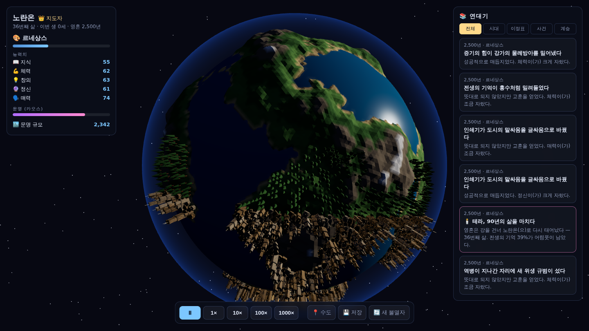
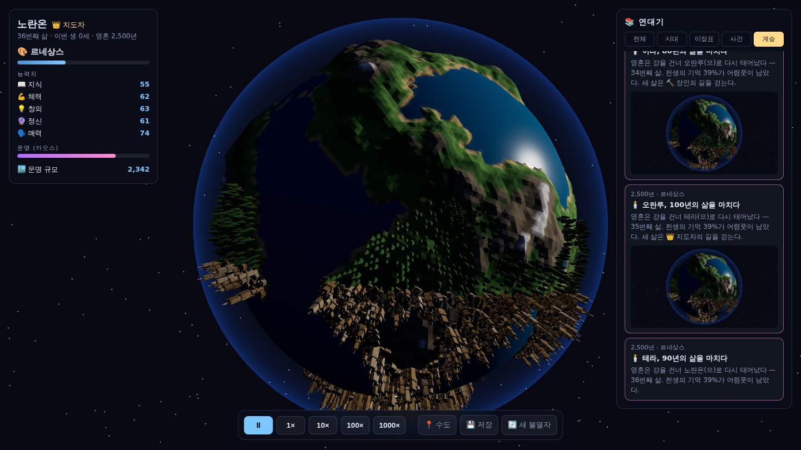
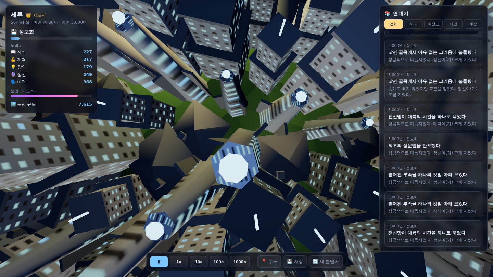
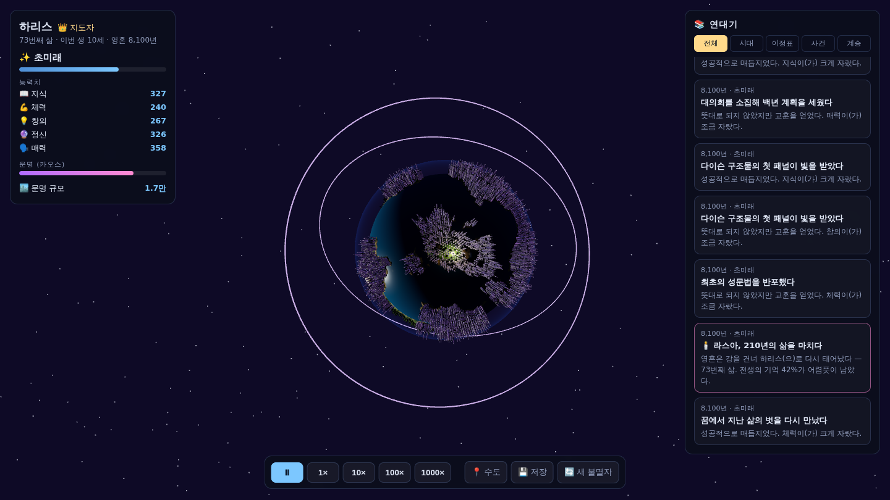

# 영원의 행성 (Aeterna)

**불멸자 문명 관전 시뮬레이션 — 실시간 3D 리부트.**

이전 프로젝트 「불멸의 연대기」(Next.js · React · 2D 아이소메트릭 베이크드 스프라이트)의
**기획만 차용**하고, 구현은 전혀 새로운 환경에서 처음부터 다시 만든 시안입니다.

> 우주에 떠 있는 절차 생성 미니 행성. 그 위에서 한 영혼이 눈을 뜨고 —
> 불멸자로, 환생자로, 혹은 왕조의 시조로 — 그의 성향에 따라 문명이
> 고대 농경에서 끝없는 초미래까지 자라나는 것을 궤도 위에서 관전합니다.

| | |
| --- | --- |
|  |  |
| 수도에서 퍼져나가는 정착지와 숲 | 환생 연대기 — 죽음, 계승, 성향 표류 |
|  |  |
| 표면 줌인 — 창문이 켜진 마천루 사이 | 초미래 — 네온 첨탑과 궤도 링 |

## 무엇이 새로운가

| | 이전 (불멸의 연대기) | 새 시안 (Aeterna) |
| --- | --- | --- |
| 스택 | Next.js · React · Zustand · Tailwind | **Vite · 순수 TypeScript · Three.js** (프레임워크 없음) |
| 무대 | 고정 격자 아이소메트릭 타일맵 | **시드 기반 절차 생성 3D 행성** — 캐릭터마다 다른 지형 |
| 렌더링 | 사전 베이크된 PNG 스프라이트 + Canvas2D | **실시간 WebGL** — 인스턴싱 건물, 낮/밤 순환, 대기 산란, 궤도 링 |
| 카메라 | 고정 시점 | 자유 궤도 카메라 (드래그/줌, 자동 회전) |
| 연대기 사진 | SVG 장면 재구성 | **실제 렌더 프레임 캡처** (WebGL → JPEG) |
| 상태 관리 | Zustand + persist | 의존성 없는 순수 엔진 + localStorage |
| 캐릭터 수명 | 불멸 고정 | **불멸 / 환생 / 왕조** 3가지 삶의 방식 |

## 삶의 방식 — 불멸을 넘어서

"영원히 사는 한 명"은 시나리오가 정적이라는 한계가 있어, **죽음을 순환의
장치**로 쓰는 두 모드를 추가했습니다. 어느 쪽이든 연대기는 끊기지 않고
계속됩니다 — 관전 대상이 '몸'이 아니라 '영혼/계보'가 되는 것뿐입니다.

| | ♾️ 불멸자 | 🕯️ 환생자 | 👑 왕조 |
| --- | --- | --- | --- |
| 죽음 | 없음 | 수명이 다하면 환생 | 서거 후 후계자 즉위 |
| 이름 | 불변 | 매 삶마다 새 이름 | "가문명 N세" |
| 능력치 | 계속 누적 | 30~60%만 계승 (정신↑ → 계승률↑) | 42~70% 승계 (매력↑ → 승계률↑) |
| 성향 | 불변 | 35% 확률로 표류 | 15% 확률로 표류 |
| 고유 사건 | — | 전생의 기억 | 선대의 유산 |
| 리스크 | — | 운명이 다시 섞임 | 후계 분쟁 (문명 -12%) / 결집 (+8%) |

- 수명은 시대(의술)와 체력이 늘립니다 — 고대엔 30~50년, 초미래엔 수백 년.
- 모든 죽음/계승은 연대기에 사진과 함께 기록되고, 연대기 필터 `계승`으로
  모아 볼 수 있습니다.
- 이정표: 열 번째 삶, 쉰 번째 삶.

## 지도 확대 — 궤도에서 지붕 높이까지

- 마우스 휠로 **행성 지붕 높이 바로 위까지** 줌인할 수 있습니다. 가까울수록
  회전/줌 속도가 느려져 저공 관찰이 조작 가능하고, 야간엔 근접 보조광이
  은은하게 켜집니다.
- 건물은 인스턴싱 위에 **파트 조합 + 절차 생성 창문 텍스처**로 만들어져
  확대해도 형태가 유지됩니다: 오두막(원통 벽+초가), 가옥(박공지붕+굴뚝),
  타워(2단 셋백+옥상 슬래브+안테나), 첨탑(테이퍼 기둥+핀+발광 첨두).
  창문은 낮엔 어두운 창틀, 밤엔 시대 색으로 점등됩니다.
- 도시 경계 밖에는 **숲**이 자라며, 문명이 확장되면 그 자리부터 벌목됩니다.
- `📍 수도` 버튼은 카메라를 문명의 중심 상공으로 부드럽게 이동시킵니다.

## 기획 계승 매핑 (원본 요구사항 → 새 구현)

| 기획 | 구현 |
| --- | --- |
| 캐릭터 추가 + 성향 선택 | 생성 화면에서 이름 + 삶의 방식(불멸/환생/왕조) + 7성향 — `engine/dispositions.ts` |
| 죽지 않고 무한히 성장 | 영혼/계보 단위로 `year` 상한 없음 — 환생·왕조도 연대기는 영원히 이어짐 — `engine/simulation.ts` |
| 성향 기반 성장 | 성향별 `growth` 가중치 + `techAffinity`가 능력치·기술 발전 속도를 결정 |
| 고대 농경 → 끝없는 초미래 | 10개 명명 시대 + 초미래 II, III… 무한 생성, 시대마다 임계 기술 증가 — `engine/eras.ts` |
| 중요 순간 로그 + 시점 사진 | 시대 진입·이정표·사건이 연대기에 기록되고 그 순간의 행성을 실제 캡처 — `World.captureSnapshot()` |
| 시간 흐름 조절 (멈춤~1000배) | ⏸ / 1× / 10× / 100× / 1000× — `main.ts` 메인 루프 |
| 저장 + 이어하기 | 5초 자동 저장 + 수동 저장, 새로고침 시 이어하기 — `engine/store.ts` |
| 새 캐릭터 시 초기화 | "새 불멸자" 버튼 → 저장 삭제 후 생성 화면 복귀 (행성도 새로 생성됨) |
| 사건 다양성 · 고갈 방지 | 성향 테마 + 시대군 플레이버 풀, 사건 간격 상한 20년의 O(1) 스케줄링 — `engine/events.ts` |
| 카오스 '운명' | 로지스틱 사상(r=3.86) 상태가 사건 성패를 흔들고 HUD 게이지로 표시 |
| 신비주의자 구제 | `정신` 능력치가 사건 성공 확률을 보정(`spiritEdge`) |
| 영토 확장 | 문명 지수가 수도로부터 각거리 순으로 정착지를 넓혀 행성 전체를 덮음 — `world/civilization.ts` |
| 이정표 | 천 년/만 년 생존, 우주 진출, 초월, 능력 총합 돌파 등 — `MILESTONES` |

## 실행

```bash
npm install
npm run dev       # 개발 서버 (http://localhost:5173)
npm run build     # 타입체크 + 프로덕션 빌드
npm run preview   # 빌드 결과 미리보기
```

## 구조

```
src/
  engine/            렌더링과 완전히 분리된 순수 시뮬레이션 코어 (three.js 의존 없음)
    types.ts         도메인 타입
    rng.ts           시드 기반 결정론적 난수
    dispositions.ts  7가지 성향 정의
    eras.ts          시대 정의 + 무한 초미래 생성 + 시대별 기술 임계
    events.ts        사건 생성 (성향 테마 / 시대 플레이버 / 전생 기억 / 운명 보정)
    names.ts         환생 이름·왕조 세대명 생성
    simulation.ts    성장·기술·시대·사건·수명·계승·이정표 틱 엔진
    store.ts         연대기 추가 + localStorage 저장/불러오기 (v1 세이브 호환)
  world/             Three.js 비주얼 계층
    planet.ts        시드 기반 절차 생성 행성 (지형·바다·대기 글로우)
    theme.ts         시대별 팔레트/발광/건물 스타일/궤도 링
    civilization.ts  파트 조합 건물(창문 텍스처)·숲·궤도 링 인스턴싱 동기화
    scene.ts         씬·카메라(표면 줌·수도 이동)·태양(낮/밤)·별·아바타·스냅샷
  ui/                의존성 없는 DOM HUD
    hud.ts           생성 화면 / 상태 패널 / 시간 제어 / 연대기 / 사진 모달
    format.ts        만/억/조 단위 수 포매팅
  main.ts            메인 루프 오케스트레이션 (rAF, 자동 저장)
```

### 설계 원칙

- **엔진/비주얼 분리** — `engine/`은 DOM·three.js를 모르는 순수 TS. 틱은
  기록할 순간(`Moment[]`)을 반환하고, 표현은 `world/`와 `ui/`가 담당.
- **결정론** — 캐릭터 이름+성향이 시드가 되어 행성 지형, 건물 배치, 사건이
  모두 재현 가능.
- **초고배속 안정성** — 프레임당 시간을 최대 10년 단위로 서브스텝 분할해
  1000배속에서도 수명·시대가 양자화되지 않음. 사건은 틱당 3건 상한,
  스냅샷은 프레임당 2장 상한.

## 로드맵 (시안 이후)

- [ ] **라이벌/인연 시스템** — 시대를 가로질러 재회하는 인물과의 반복 게임
      (팃포탯/죄수의 딜레마), 행성 반대편에 라이벌 문명 렌더
- [ ] **인터랙티브 선택** — 저배속에서 중요 사건을 일시정지 + 선택지 모달로 제시
- [ ] **환생 심화** — 전생 이름 족보 화면, 환생 직후 '기억의 파편' 보너스 선택,
      왕조 가계도 시각화
- [ ] 행성 지형의 시대 반영 (산업기 스모그, 초미래 테라포밍·수면 상승)
- [ ] 궤도 구조물 확장 (위성군, 우주 엘리베이터, 다이슨 스웜 파티클)
- [ ] 포스트 프로세싱 (블룸, 필름 그레인) 및 사운드스케이프
- [ ] 연대기 내보내기 (사진 포함 HTML/JSON)
